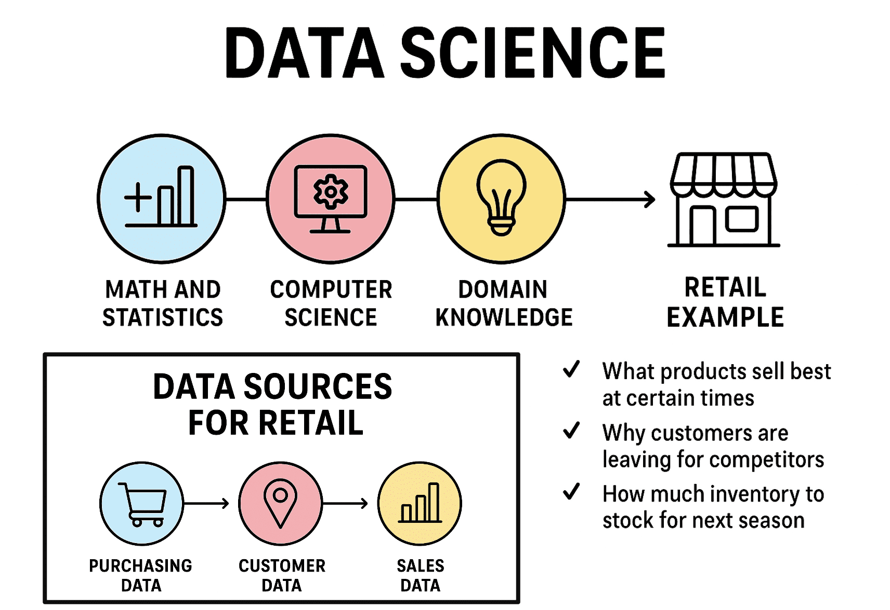

  
# Mi primer repositorio
## Introducción a la ciencia de datos
Isabella Boada

  

  **Texto en negrilla**
  
  *Cursiva*
  
  ***En negrilla y cursiva***

~tachado~

´Print()´

<pre> 
def hola():
  print("Hola")
</pre>

> Esto es una cita

- Lista
- Otro
  - Sub-elemento
    - Sub-sub_elemento
    -     Sub-sub_copy_dos_tab

1. Paso uno
2. Paso dos
3. ...

-  [ ] Tarea pendiente
-  [x] Tarea completa

| Nombre | Apellido |
|--------|----------|
| Juan   | Rodriguez|
| Carlos | Sanchez  |
| Isabella | Boada  |
| Camilo | Castillo |

>   [!WARNING]
> Prestar atención

  
 Haz clic para desplegar más información 

   Contenido oculto que se despliega

La ecuación de Einstein es $E = mc^2$

$$
x= 2^4 * y 
$$

